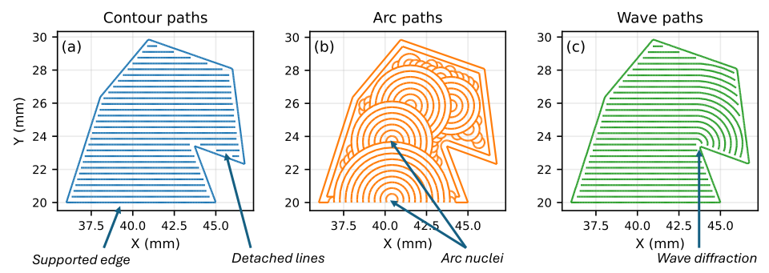
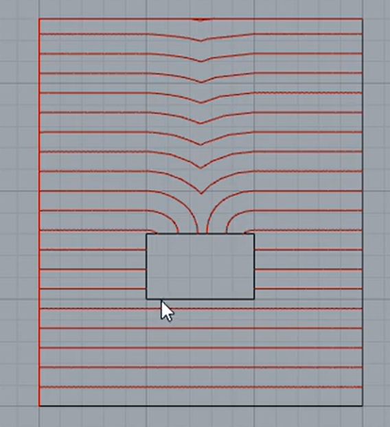
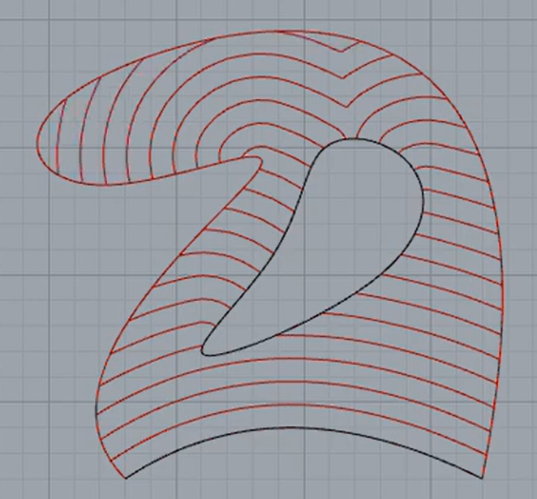
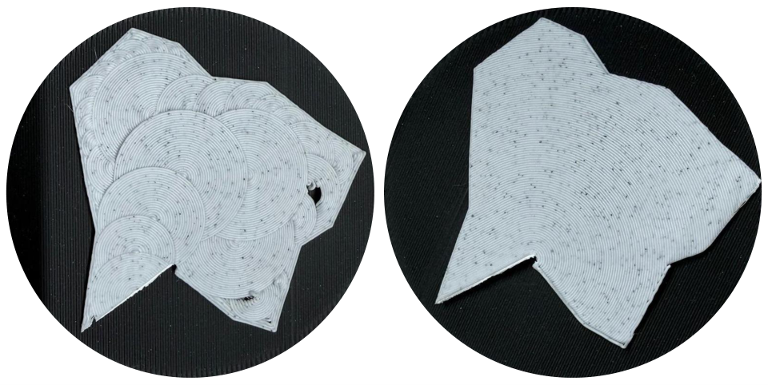
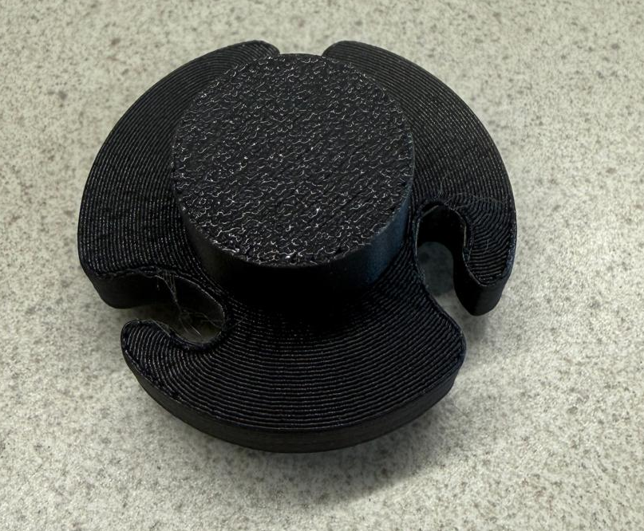
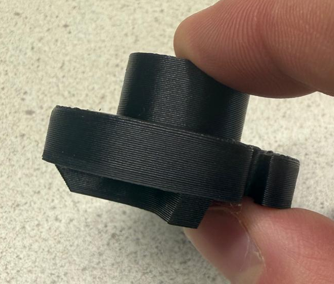

# PrusaSlicer - Wave Overhangs Demo

Wave overhangs algorithm developed and tested by Janis A. Andersons, Solemé Sanchez, and Tom Vaneker. Improves upon the [Arc Overhang](https://github.com/stmcculloch/arc-overhang) algorithm by Steven McCulloch.

## Wave overhangs

Wave overhangs is a 3D printing slicing algorithm that lets you print 90 degree overhangs without support material. Toolpaths are generated recursively based on wave propagation theory. The waves continue until they fill the available space, diffracting around corners and even around holes.

[^1]

  
  

Wave overhangs significantly improve upon the Arc Overhang algorithm by creating smoother surfaces and more streamlined toolpaths, as shown below.

[^1]

On smaller and more localized overhangs, the feature can also produce clean real-world prints:

  
  

Available settings:

* `Use wave overhangs (Experimental)`: Enables the wave-overhang path in place of legacy extra overhang perimeters.
* `Wave overhang perimeters`: Total number of regular perimeter shells to keep over the overhanging region. This replaces the normal vertical-shell perimeter count inside the reclaimed overhang area instead of adding to it.
* `Wave overhang perimeter overlap`: Extends the wave propagation boundary slightly toward the kept perimeter so the last wave sits closer to the perimeter shell.
* `Minimum wave width`: If a narrow neck in the wave region is smaller than this width, PrusaSlicer inserts a thin split there before propagation so fragile wave branches do not form.
* `Wave overhang pattern`: Chooses whether wave tracks are printed in one direction at a time (`Monotonic`), connected into a back-and-forth path (`Zig Zag`), or started from the better-supported end of each new track (`Smart`).
* `Wave overhang line spacing`: Centerline spacing between adjacent wave lines. This is the wave wavelength. Smaller spacing packs the wave fronts more tightly.
* `Wave overhang line width`: Physical extrusion width used for wave paths. This changes extrusion amount and lets adjacent unsupported wave lines overlap for better lateral adhesion.
* `Wave overhang print speed`: Print speed used while extruding wave-overhang paths.
* `Wave overhang travel speed`: Travel speed used for moves between wave-overhang lines.
* `Wave overhang fan speed`: Fan speed enforced while printing wave-overhang paths.

Wave overhangs is available through the print settings shown above and is intended for unsupported overhang regions where you want to reduce or avoid support material.

For a more user-focused explanation of the feature set, pattern choices, recommended starting values, and the rollout history in this fork, see [Wave Overhangs Guide](doc/wave-overhangs.md).

---

You may want to check the [PrusaSlicer project page](https://www.prusa3d.com/prusaslicer/).
Prebuilt Windows, OSX and Linux binaries are available through the [git releases page](https://github.com/prusa3d/PrusaSlicer/releases) or from the [Prusa3D downloads page](https://www.prusa3d.com/drivers/). There are also [3rd party Linux builds available](https://github.com/prusa3d/PrusaSlicer/wiki/PrusaSlicer-on-Linux---binary-distributions).

PrusaSlicer takes 3D models (STL, OBJ, AMF) and converts them into G-code
instructions for FFF printers or PNG layers for mSLA 3D printers. It's
compatible with any modern printer based on the RepRap toolchain, including all
those based on the Marlin, Prusa, Sprinter and Repetier firmware. It also works
with Mach3, LinuxCNC and Machinekit controllers.

PrusaSlicer is based on [Slic3r](https://github.com/Slic3r/Slic3r) by Alessandro Ranellucci and the RepRap community.

See the [project homepage](https://www.prusa3d.com/slic3r-prusa-edition/) and
the [documentation directory](doc/) for more information.

### What language is it written in?

All user facing code is written in C++.
The slicing core is the `libslic3r` library, which can be built and used in a standalone way.
The command line interface is a thin wrapper over `libslic3r`.

### What are PrusaSlicer's main features?

Key features are:

* **multi-platform** (Linux/Mac/Win) and packaged as standalone-app with no dependencies required
* complete **command-line interface** to use it with no GUI
* multi-material **(multiple extruders)** object printing
* multiple G-code flavors supported (RepRap, Makerbot, Mach3, Machinekit etc.)
* ability to plate **multiple objects having distinct print settings**
* **multithread** processing
* **STL auto-repair** (tolerance for broken models)
* wide automated unit testing

Other major features are:

* combine infill every 'n' perimeters layer to speed up printing
* **3D preview** (including multi-material files)
* **multiple layer heights** in a single print
* **spiral vase** mode for bumpless vases
* fine-grained configuration of speed, acceleration, extrusion width
* several infill patterns including honeycomb, spirals, Hilbert curves
* support material, raft, brim, skirt
* **standby temperature** and automatic wiping for multi-extruder printing
* [customizable **G-code macros**](https://github.com/prusa3d/PrusaSlicer/wiki/PrusaSlicer-Macro-Language) and output filename with variable placeholders
* support for **post-processing scripts**
* **cooling logic** controlling fan speed and dynamic print speed

### Development

If you want to compile the source yourself, follow the instructions on one of
these documentation pages:
* [Linux](doc/How%20to%20build%20-%20Linux%20et%20al.md)
* [macOS](doc/How%20to%20build%20-%20Mac%20OS.md)
* [Windows](doc/How%20to%20build%20-%20Windows.md)

### Can I help?

Sure! You can do the following to find things that are available to help with:
* Add an [issue](https://github.com/prusa3d/PrusaSlicer/issues) to the github tracker if it isn't already present.
* Look at [issues labeled "volunteer needed"](https://github.com/prusa3d/PrusaSlicer/issues?utf8=%E2%9C%93&q=is%3Aopen+is%3Aissue+label%3A%22volunteer+needed%22)

### What's PrusaSlicer license?

PrusaSlicer is licensed under the _GNU Affero General Public License, version 3_.
The PrusaSlicer is originally based on Slic3r by Alessandro Ranellucci.

### How can I use PrusaSlicer from the command line?

Please refer to the [Command Line Interface](https://github.com/prusa3d/PrusaSlicer/wiki/Command-Line-Interface) wiki page.

[^1]: J. A. Andersons, S. Sanchez, T. Vaneker, "Wave-inspired path-planning strategy for support-free horizontal overhangs in FDM," preprint, submitted for publication.
