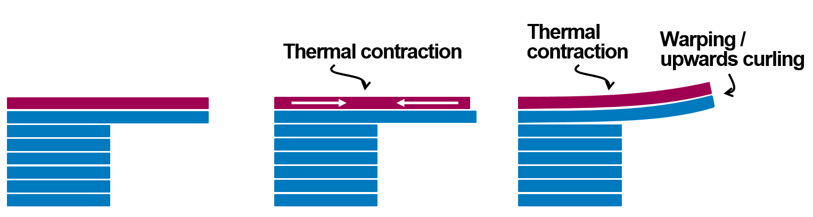
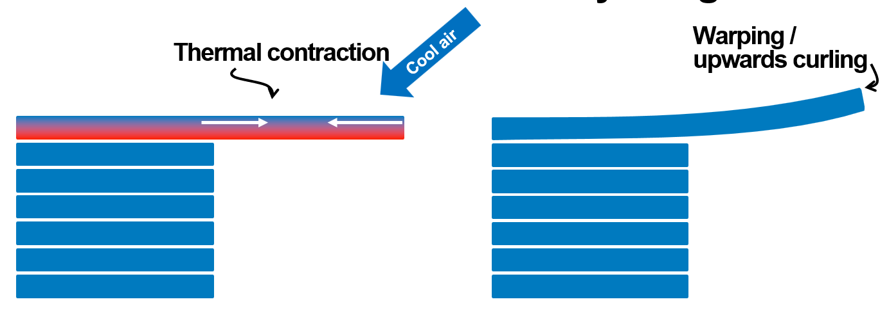
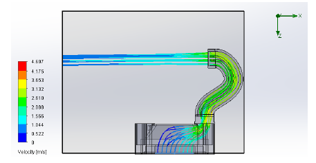
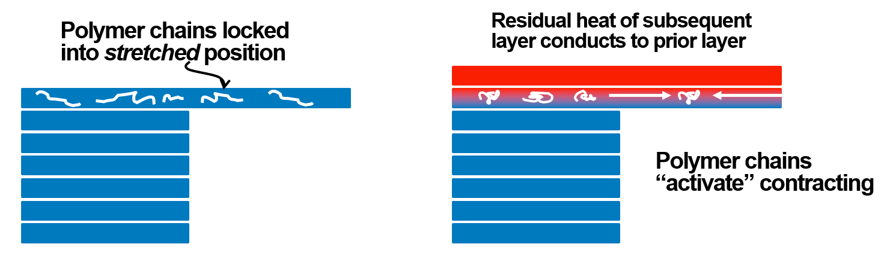
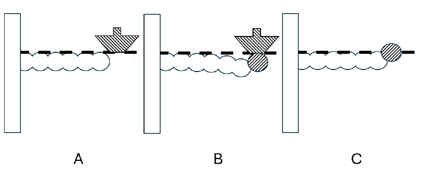
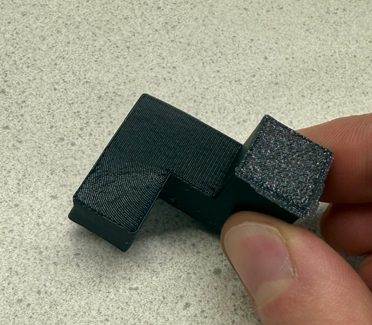
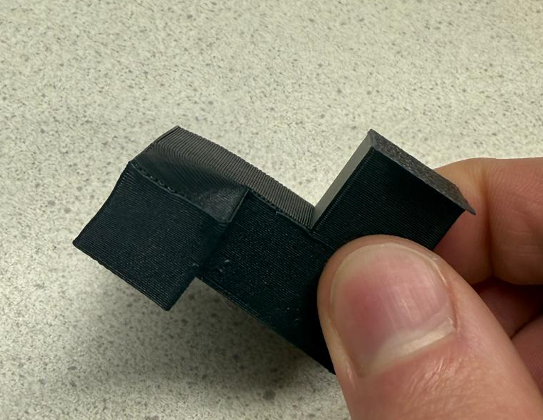

# Limitations

This page covers the current limitations of wave overhangs, with a focus on the hardest unresolved issue so far: warping of laterally supported overhangs.

## Warping

Warping of laterally supported overhangs is not a single failure mode with a single fix. Better cooling helps in some cases, but it does not solve the whole problem by itself. In some experiments and discussions around arc overhangs, the opposite approach has even been suggested: reduce cooling and let the overhang sag slightly to compensate for upward curl. That tradeoff alone makes it clear that this is a coupled thermal, mechanical, and process-control problem rather than a simple fan-tuning issue.

An in-depth investigation into warping is still in progress. The current working view is that several mechanisms can act at the same time.

## Main warping mechanisms

### Thermal contraction from temperature gradients

This is the most obvious and probably the most universal mechanism. Whenever different parts of a printed feature cool at different rates, they want to contract by different amounts. That creates residual stress, and residual stress creates deformation.

For laterally supported overhangs, this means that adding layers above the unsupported region tends to curl the structure upward. This applies regardless of whether the base overhang path was generated with arcs, waves, or some other strategy.

Single-layer overhangs are not immune either. Even the first overhanging layer can develop a temperature gradient when cooling is applied mostly from above, because the top of the strand cools faster than the bottom.

 [^1]

One way to isolate this mechanism is to cool the unsupported layer more evenly from both top and bottom. A custom duct built for that purpose significantly reduced single-layer warping in testing.

 [^1]

That result matters because it suggests at least part of the problem is directly tied to the cooling-induced temperature field, not only to the geometry of the path itself.

### Shape memory polymer effects

Another suspected mechanism is shape memory polymer behavior in the deposited plastic.

 [^1]

When a strand is deposited, the polymer chains can become locked into a stretched or otherwise non-equilibrium state. Later, when a subsequent layer reheats the earlier one, some of those chains can become mobile again and contract. That produces additional deformation that is difficult to predict from geometry or cooling alone.

This is related to the broader class of effects used intentionally in 4D printing, but here it acts as another hard-to-model source of warping.

### Nozzle pressure on large spans

Large single-layer overhang spans appear to suffer from another effect: the pressure of the extruded filament and nozzle interaction can push the unsupported region downward during deposition.

 [^1]

Once early tracks are displaced, later tracks may be laid down slightly higher, and the failure can quickly cascade into severe distortion. One planned way to isolate this effect is to print on a 5-axis FDM setup and reorient the nozzle so it does not apply the same downward load to the overhang.

## Why this is still under investigation

The important point is that these mechanisms can overlap:

- Later layers can induce thermal contraction.
- Top-only cooling can warp even a single unsupported layer.
- Reheating can reactivate polymer-chain contraction.
- Nozzle pressure can physically disturb large spans during deposition.

That is why there is no credible claim yet that warping is "solved." The current state is closer to active investigation plus a growing set of practical mitigations.

## Example prints

The print photos below help show why warping should be treated as geometry- and span-dependent rather than as a binary "works" or "doesn't work" issue.

### Warping on larger overhangs

These larger-span examples show visible curl and distortion in the overhanging region.

  
  

### Smaller overhangs can remain clean

These smaller-overhang examples show that the same general approach can print cleanly when the unsupported region is more limited. In other words, warping is not equally severe across all scales; it becomes much more problematic on larger spans.

  
  

## Practical mitigations observed so far

Several print choices appear to make a meaningful difference already.

### Material choice

Short-fiber-reinforced materials such as `GF-PLA` and `CF-PLA` appear especially promising. Compared with ordinary PLA, they can help because of:

- Higher viscosity.
- Higher thermal conductivity.
- Lower coefficient of thermal expansion.

Those three properties all tend to push in a favorable direction for overhang stability.

### What happens above the LaSO matters a lot

The layers deposited after the laterally supported overhang often matter as much as the overhang path itself. The key goal is to build a critical thickness as quickly as possible so the feature can resist bending before residual stresses accumulate too far.

In practice, that suggests:

- Remove bottom shells above the reclaimed overhang when possible.
- Use the sparsest infill that still makes sense structurally.
- Prefer `Lightning` infill when available.

Infill pattern matters too. Straight, repetitive paths can contract in a strongly aligned direction and increase curl. More distributed or curved patterns spread those contraction directions out more favorably:

- `Rectilinear` or other straight-line patterns may encourage curling.
- `Gyroid` can behave better because its S-shaped paths can partly straighten as they contract.
- `Lightning` is especially attractive because its branching directions distribute contraction more randomly.

Related idea: using Hilbert curves in the layers above the LaSO may reduce residual stress enough to lower warping while still allowing multiple solid layers above the overhang. Stefan discussed this in a follow-up arc-overhang video: <https://youtu.be/TGa_KvKLDR8?t=455>.

More broadly, tuning the printing settings of the subsequent layers can reduce warping substantially and, in some cases, may nearly eliminate it.

### Lower nozzle temperatures during and after the overhang

Another plausible mitigation is to reduce nozzle temperature while printing the unsupported overhang layer and the next `2-4` layers above it.

At the slow print speeds commonly used here, around `2-4 mm/s`, PLA can often still print at roughly `170-180 C`. Lower temperatures may help by:

- Reducing temperature gradients.
- Increasing melt viscosity.
- Reducing unwanted nozzle overlap and downward pushing effects.

The same slower, cooler approach may also help in the immediately subsequent layers, where much of the harmful reheating happens.

### Set reasonable size limits

Large stress-test polygons are useful for research, but they are often less representative of normal part geometry. In real use, many overhang regions are smaller and less extreme.

That suggests a practical slicer strategy:

- Use wave overhangs on smaller, simpler regions.
- Fall back to traditional support on larger or more aggressive spans.

The simplest version would be a threshold such as "if overhang area or cantilever distance exceeds X, use support material instead."

## Current takeaway

Warping is a known issue, not an ignored one. The main open question is not whether warping exists, but which mechanisms dominate under which conditions and how far slicer settings and process tuning can push the problem before support material becomes the better option.

For now, the strongest levers appear to be material choice, tuning of the layers above the overhang, cooling strategy, nozzle temperature, and being realistic about the span sizes where unsupported wave overhangs should be attempted.

## See also

- [Wave Overhangs Guide](wave-overhangs.md)
- [Wave-overhang releases](https://github.com/stmcculloch/PrusaSlicer-WaveOverhangs/releases)

[^1]: J. A. Andersons, S. Sanchez, T. Vaneker, "Wave-inspired path-planning strategy for support-free horizontal overhangs in FDM," preprint, submitted for publication.