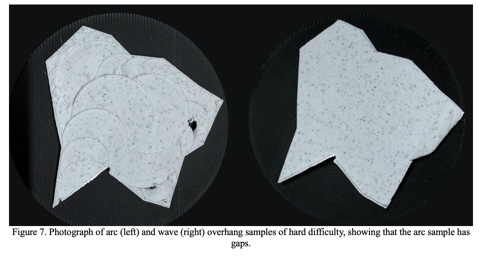
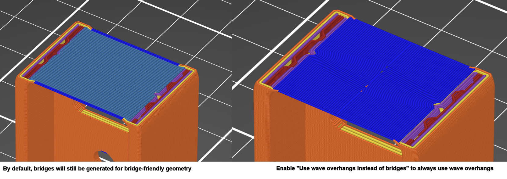
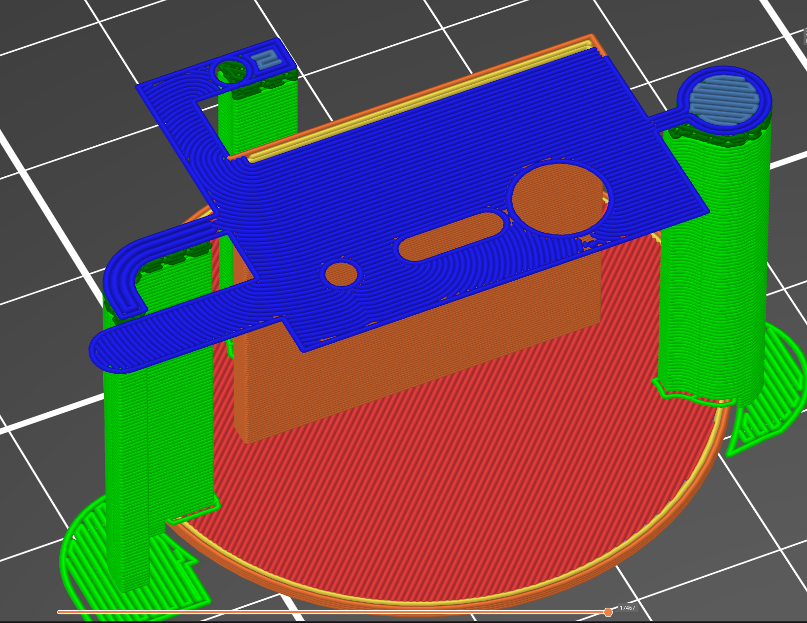
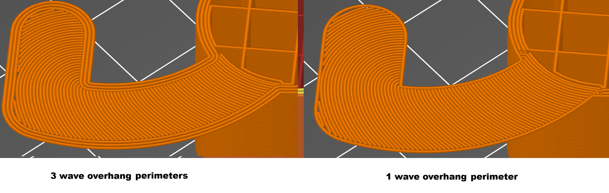
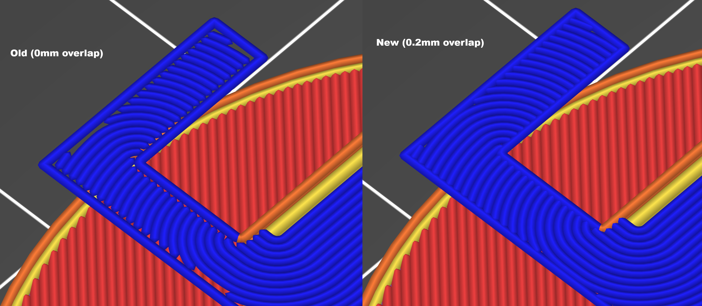
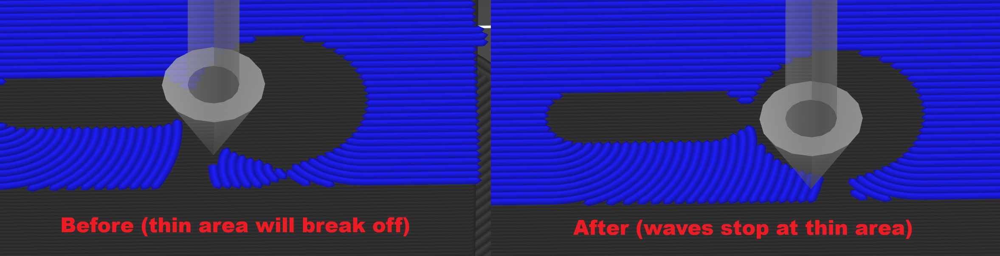
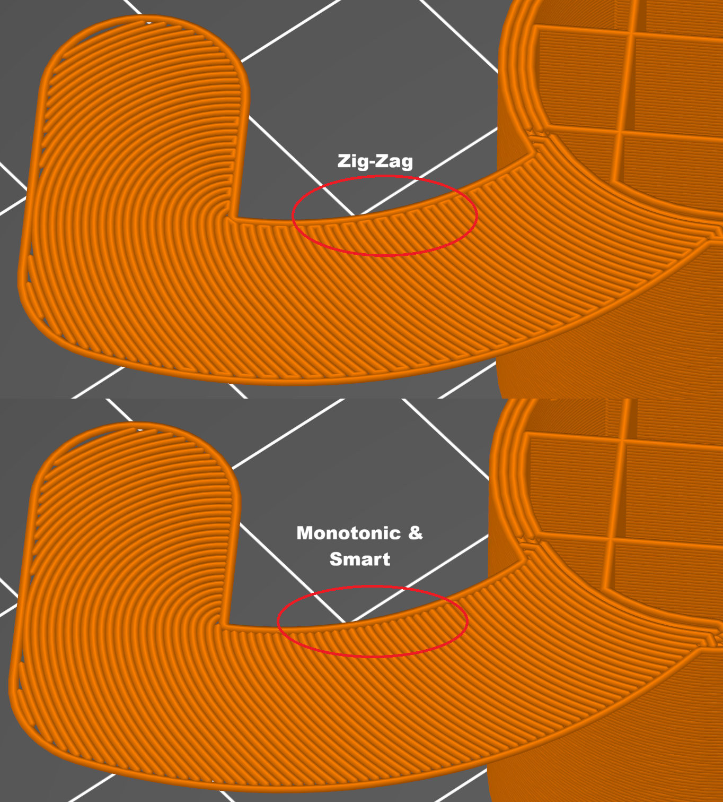
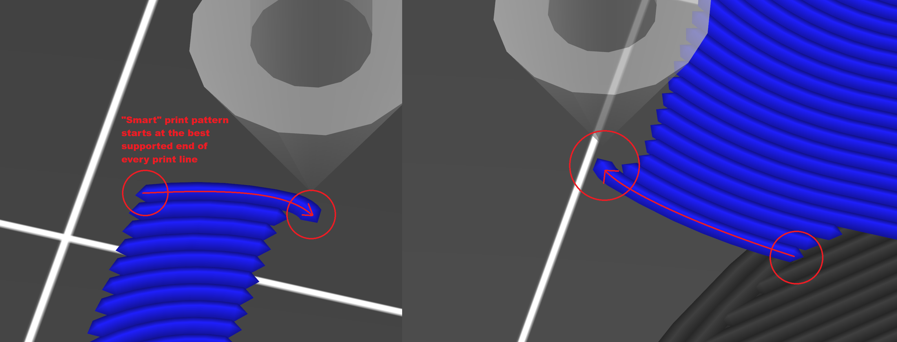
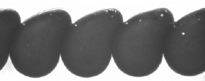
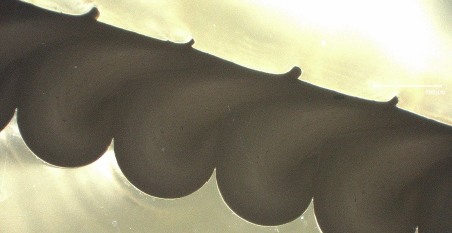

# Wave Overhangs Guide

Wave overhangs allow you to print unsupported overhangs with wave-shaped toolpaths instead of ordinary support material. 

## Why use wave overhangs?

- Reduce the amount of support material printed, saving plastic.
- Reduce time spent post-processing
- Reduce unnecessary support-removal scars
- Enables printing internal overhangs which could not be easily supported, or where support removal would be too difficult.
- Enables printing very shallow overhang angles (e.g. 80-90 degrees)

Compared with the earlier [arc-overhang approach](https://github.com/stmcculloch/arc-overhang), wave overhangs produce smoother, more elegant toolpaths and are better at handling difficult shapes, including concave areas and holes in the overhanging region.

 [^1]
## Limitations

Warping is the main limitation currently, especially on larger unsupported spans. For a deeper discussion of warping mechanisms, example prints, and mitigation strategies, see [Limitations](limitations.md).

Using wave overhangs for very large overhangs is not recommended.

## Settings guide

This section covers each setting added so far

### `Use wave overhangs (Experimental)`

This is the main switch to turn on wave overhangs. When enabled, the slicer detects unsupported overhanging bottom-surface regions, but fills those regions with wave-generated toolpaths instead.

### `Use wave overhangs instead of bridges`

By default, bridges and wave overhangs can both exist in the same print. The slicer will use bridges when the geometry is compatible and bridge-friendly, otherwise it will use wave overhangs. Enabling this setting forces wave overhangs to always be used in place of bridges.

Recommended use:

- Leave it `off` by default unless your printer has trouble bridging long gaps.
- Turn it `on` to improve the consistency of the appearance of overhanging bottom surfaces. Will likely increase print time.

### `Don't support wave overhangs`

Prevents support structures from being generated underneath wave overhangs. Allows a hybrid approach, so supports are generated only for the areas that need it.

You probably always want to keep this enabled. This setting probably shouldn't even exist and rather be a hardcoded to always be enabled, but it follows the same design pattern as bridging, which has a setting called "Don't support bridges". 

  

### `Wave overhang perimeters`

This controls how many perimeter shells are printed around the wave-filled region.

- One perimeter usually results in better quality and increases printability of narrow overhanging regions.
- Cannot exceed the standard perimeter count.
- Recommended default value: `1`

### `Wave overhang perimeter overlap`

This ensures good connection to the perimeter line by slightly overlapping the waves with the perimeter line.

- Reduces the visible gap between the wave region and the perimeter.
- Improves bonding where the wave field meets the kept perimeter.
- Prevents edge detachment failures.

Recommended starting value: `0.1 mm`

Practical tuning range: roughly `0.05 mm` to `0.2 mm`

### `Minimum wave width`

Prevents waves from propagating through very narrow passageways to improve printability. Very thin wave branches often do not print successfully.

  

- Larger values make the slicer split more aggressively before wave propagation.
- Recommended starting value: `0.7 mm`

Raise it when:

- Thin necks are breaking off.
- Preview shows waves entering regions that are clearly too narrow to survive in reality.

### `Wave overhang pattern`

This chooses how the generated wave lines are ordered and printed.

`Monotonic`

- Prints each line in one consistent direction.
- Most predictable behavior.
- Gives neighboring lines more time to cool.
- Usually adds more travel and retraction.

`Zig Zag`

- Connects lines into a back-and-forth path, printing branches all the way to the end using a 'depth-first' ordering .
- Minimizes travel moves and retractions.
- Can be attractive on simple geometry but may fail on more complex cases.
- May build up more local heat and droop more easily in difficult cases.

`Smart`

- Uses same pattern as monotonic, but intelligently chooses the most supported end to start from.
- Starts each line from the better-supported end.
- Avoids starting new lines 'in thin air' with no anchor.
- Best general-purpose default.

Recommended default: `Smart`

### `Wave overhang line spacing`

This is the centerline spacing between adjacent wave paths.

- Should be smaller than nozzle diameter to ensure overlap
- Smaller values will result in better details and small features but will take longer to print

Recommended starting value: `0.35 mm`

### `Wave overhang line width`

This is the extrusion width used by the slicer for printing the wave paths themselves. Used to calculate toolpath lines and flow amounts.

- Should be slightly greater than wave line spacing to ensure overlap with previously laid lines

Recommended starting value: `0.4 mm`

### `Wave overhang flow ratio`

This applies a flow modifier only to wave lines to compensate for the drooping effect:

  
  

- Unsupported wave lines do not behave like ordinary fully supported extrusions.
- In real prints they often form a teardrop-like bead shape.
- Flow ratio lets you adjust actual deposited material without changing wave spacing, width, or path generation.
- Increase this if wave lines are not bonding well.

Recommended starting value: `1.0`

### `Wave overhang print speed`

This is the print speed used while printing wave lines.

Slower speeds generally help wave overhangs because each line needs time to cool down before the next one is laid down.

Recommended starting value: `2 mm/s`

### `Wave overhang travel speed`

This is the travel speed used between wave lines.

Reducing travel speed may improve reliability.

Recommended starting value: `40 mm/s`

#### `Wave overhang fan speed`

This is the fan speed enforced while printing wave-overhang paths. This allows you to enable fans only when printing wave overhangs, but keep fans off for the rest of the print.

Maximum cooling is necessary to stabilize the unsupported material, so keep this at 100%.

Recommended starting value: `100%`

## Troublehsooting

- Edge detaching from the kept perimeter: increase `Wave overhang perimeter overlap`.
- Thin branches or necks breaking off: increase `Minimum wave width`.
- Ordinary bridges appearing where you want waves: enable `Use wave overhangs instead of bridges`.
- Weak bonding between wave lines: increase `Wave overhang flow ratio`.

## See also

- [README](../README.md)
- [Limitations](limitations.md)
- [Wave-overhang releases](https://github.com/stmcculloch/PrusaSlicer-WaveOverhangs/releases)

[^1]: J. A. Andersons, S. Sanchez, T. Vaneker, "Wave-inspired path-planning strategy for support-free horizontal overhangs in FDM," preprint, submitted for publication.
